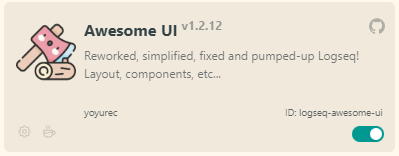
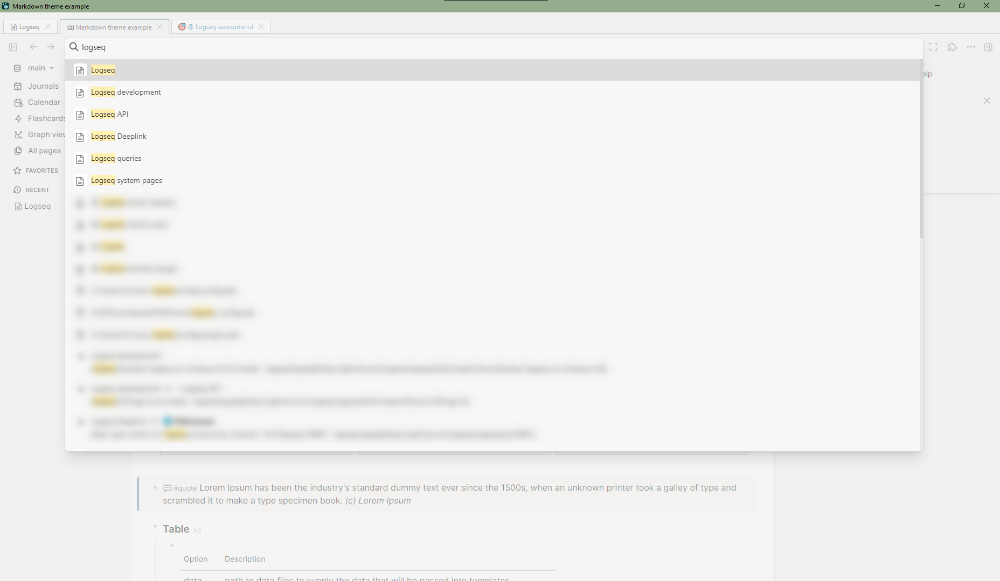
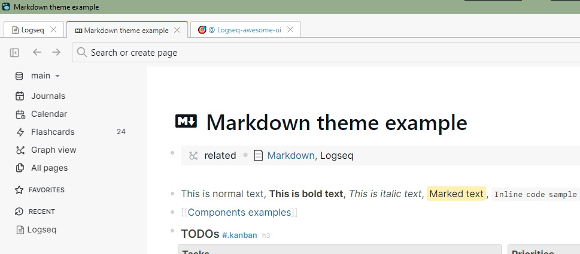
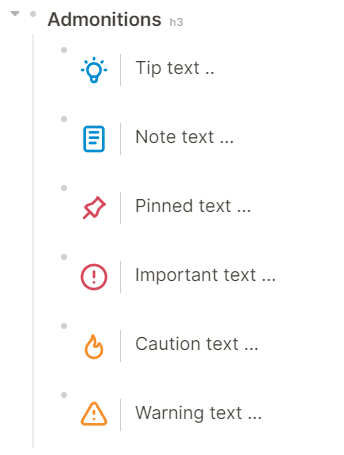

<h1 align="center">"Awesome UI" plugin for Logseq</h1>

    

* 🐱‍👤 Changed default UI layout, sidebars
* ✨ Changed icons, new added
* 🔥 Redesigned head toolbar: navigation arrows on left side, hidden home...
* 🔍 Redesigned search <a href="#-search-panel">🡖</a>
* 🗂 **"Tabs"** plugin panel was moved to top & auto-recolored to current (ANY) theme<a href="#-tabs-plugin">🡖</a>
* ⚙ Simplified, less noise and compact Logseq plugins settings popup
* 📋 Compact QUERY results header: settings, table toggler <a href="#-compact-query-results-header">🡖</a>
* 📝 Redesigned admonition blocks <a href="#-redesigned-admonition-blocks">🡖</a>
* 🧮 Redesigned calculator via @Playerofgames <a href="#-redesigned-calculator">🡖</a>

## If you ❤ what i'm doing - you can support my work! ☕

## Install plugin
From Logseq store - `Plugins -> Marketplace`.

## Recommended plugins/themes
* 🐱‍👤 [Solarized Extended](https://github.com/yoyurec/logseq-solarized-extended-theme)
* ⭐ [Awesome Links](https://github.com/yoyurec/logseq-awesome-links)
* 📌 [Sticky Headers](https://github.com/yoyurec/logseq-sticky-headers)
* 📰 [Banners](https://github.com/yoyurec/logseq-banners-plugin)
* [Tabs](https://github.com/pengx17/logseq-plugin-tabs)

### 🔍 Search panel

Wide responsive search like in browser!

### 🗂 Tabs plugin

### 📝 Redesigned admonition blocks

### 📋 Compact QUERY results header

### 🧮 Redesigned calculator

## What is Logseq?
Logseq is a privacy-first, open-source knowledge base. Visit https://logseq.com for more information.

## Support
* Read about Logseq plugin updates on Dicscord - https://discord.com/channels/725182569297215569/896368413243494430
* Ask about Logseq plugins on Dicscord - https://discord.com/channels/725182569297215569/752845167030960141
* If you have any questions, issues or feature request, use the issue submission on GitHub: https://github.com/yoyurec/logseq-awesome-ui/issues

## Credits
* Icon - https://www.flaticon.com/free-icon/handcraft_3859663 + https://www.flaticon.com/free-icon/firewood_1732431
* Calculator styles - @Playerofgames https://github.com/playerofgames/logseq-mia-theme

## License

[MIT License](./LICENSE)
